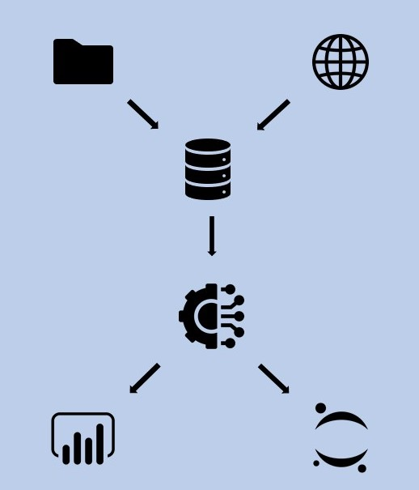

# PSD 

PSD (Pará Security Data) is a personal project for scraping and analyze security data of the state of Pará available on Portal da Transparência - Secretaria de Segurança Pública e Defesa Social do Pará (http://sistemas.segup.pa.gov.br/transparencia/#1577643346294-a9d88b58-627c).

The project is divided in three parts:
1. Scrapping Data and ETL
2. Exploratory Analysis
3. Presentation of security indicators on a dashboard

.

## 1. Scrapping Data and ETL

The first of the project is all done in Python. Security data is downloaded from the server by web scrapping techniques and population data are downloaded directly from the IBGE website (https://www.ibge.gov.br/estatisticas/sociais/populacao/9103-estimativas-de-populacao.html?=&t=downloads ) in .xls format and converted to .csv. this approach was used because it is a small amount of files that do not need much treatment. After that, the ETL was performed on both bases.

## Running PSD Locally
Runnins PSD Locally in your enviroment is very easy. Be sure you have Git and Python 3.0 installed. PSD get data from web page and filter data and saves in a .csv format that will be used in power BI. 

1. Clone the soure code 

`https://github.com/DiegoLCFelipe/security-data-para`

2. Install requests

`python -m pip install requests`

3. Install Beautiful Soup

`python -m pip install beautifulsoup4`

4. Install lxml parser

`python -m pip install lxml`

5. Install Pandas

`python -m pip install pandas`

6. Install tqdm

`python -m pip install tqdm`

7. Create Directory data (default)

`mkdir data`

8. Execute

`python main.py`

